<div align="center">

# 🏨 StayEase

<a href="https://drive.google.com/file/d/1S0b13ExFMtixVy_OczhqmsXRPi5MP7N9/view?usp=sharing">


</a>

**A Complete Real-Time Hotel Booking & Management Ecosystem**

[](https://flutter.dev)
[](https://firebase.google.com)
[](https://dart.dev)
[](https://pub.dev/packages/provider)

</div>

## 📖 About The Project

**StayEase** is a comprehensive, dual-role mobile application built using Flutter and Firebase to streamline the hotel booking process. Designed for both travelers and property managers, the platform reduces manual booking overhead by connecting customers and hotel owners in a single, real-time ecosystem.

Customers can discover hotels, view interactive map routes, and track booking statuses, while hotel owners get a powerful dashboard to manage inventory, track revenue analytics, and instantly approve or reject incoming requests.

---

## ✨ Key Features

### 🧑‍💻 For Customers

- **Discovery & Search:** Browse hotels, filter by city, and search by name.
- **Interactive Maps:** View hotel locations via `flutter_map` and get turn-by-turn driving directions using the OSRM routing API.
- **Live Booking Tracking:** Check real-time statuses (Pending, Accepted, Rejected, Cancelled) directly from a personalized dashboard.
- **Push Notifications:** Get instantly alerted when a hotel owner accepts or rejects a request.

### 🏢 For Hotel Owners

- **Analytics Dashboard:** Track total revenue, active listings, and booking request statistics in real-time.
- **Inventory Management:** Add, edit, or delete hotel listings featuring images and geolocation coordinates.
- **Smart Media Upload:** Upload high-quality hotel images directly to the cloud via Cloudinary.
- **1-Tap Approvals:** Review customer requests and accept/reject bookings directly from the dashboard.

### ⚙️ Global App Features

- **Dual-Role Authentication:** Secure Email/Password and Google Sign-In with automatic role-based routing.
- **Adaptive Theme:** Global Dark/Light mode toggle powered by Provider (`ThemeProvider`).
- **Glassmorphism UI:** Premium, modern UI design with frosted glass components and smooth animations.

---

## 📱 App Gallery

### 🧑‍💻 Customer Experience

|                            Login & Auth                             |                            Customer Home                             |                            Hotel Details                             |
| :-----------------------------------------------------------------: | :------------------------------------------------------------------: | :------------------------------------------------------------------: |
| 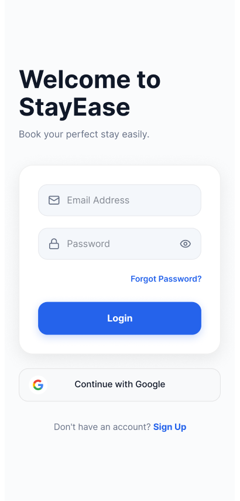 | 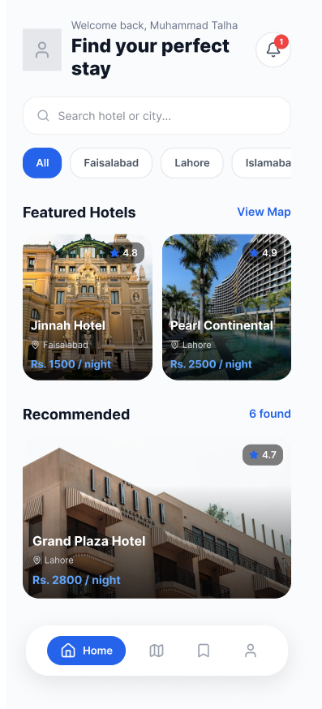 | 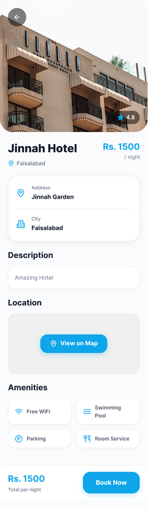 |

|                         Map & Live Route                         |                               My Bookings                                |                            Customer Profile                             |
| :--------------------------------------------------------------: | :----------------------------------------------------------------------: | :---------------------------------------------------------------------: |
| 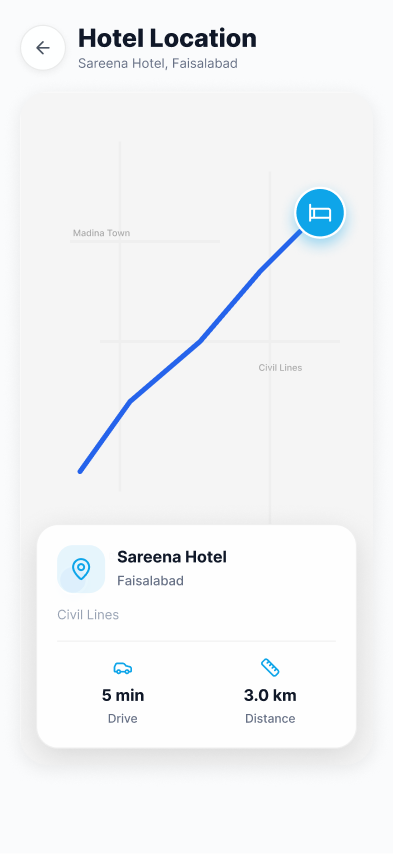 | 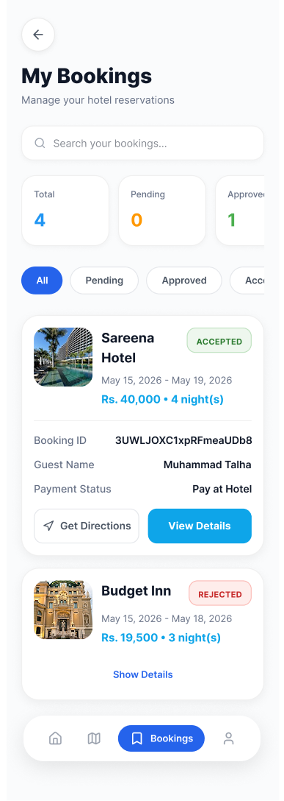 | 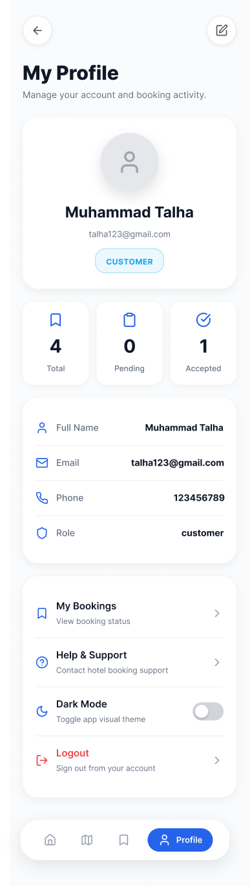 |

### 🏢 Hotel Owner Experience

|                            Owner Dashboard                             |                       My Hotels Inventory                        |                          Add New Hotel                           |
| :--------------------------------------------------------------------: | :--------------------------------------------------------------: | :--------------------------------------------------------------: |
| 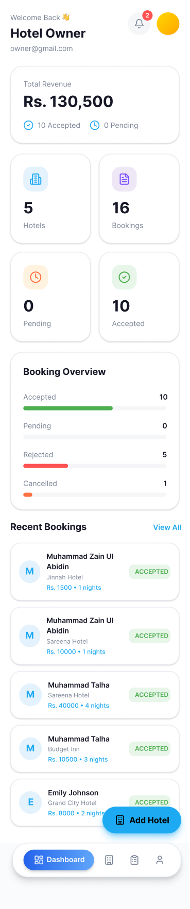 | 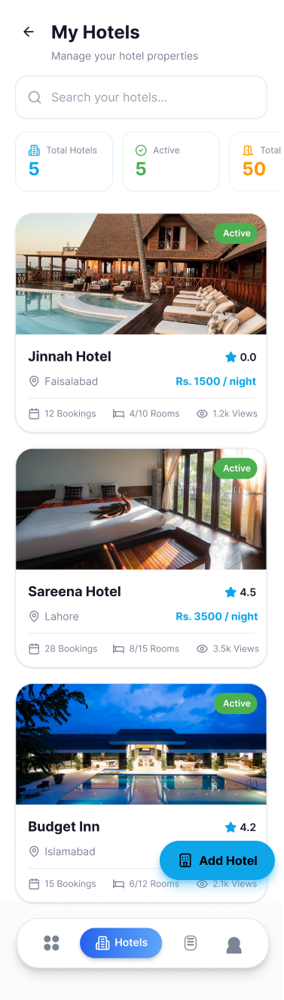 | 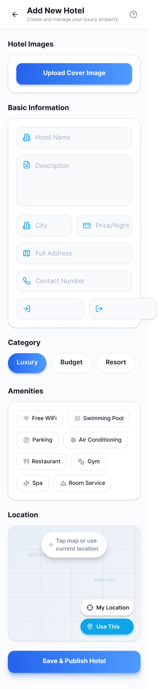 |

|                            Edit Hotel                             |                            Booking Requests                             |                         Notifications Inbox                          |
| :---------------------------------------------------------------: | :---------------------------------------------------------------------: | :------------------------------------------------------------------: |
| 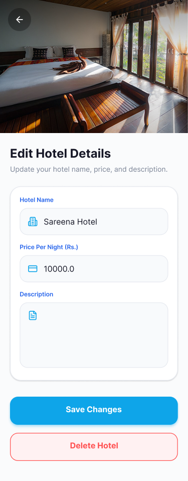 | 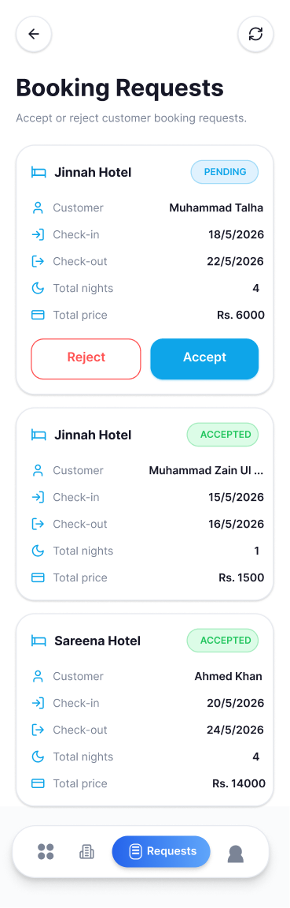 | 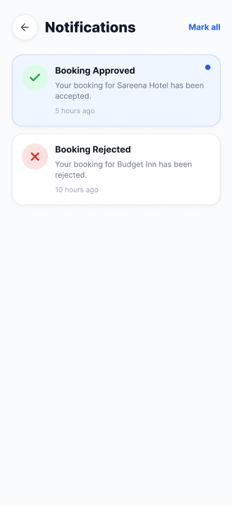 |

---

## 🛠️ Technology Stack

- **Frontend:** Flutter (Dart)
- **Backend (BaaS):** Firebase (Authentication, Cloud Firestore)
- **State Management:** Provider (ChangeNotifier)
- **Maps & Geolocation:** `flutter_map`, `geolocator`, `latlong2`, CartoDB base maps
- **Routing API:** Open Source Routing Machine (OSRM) via HTTP REST API
- **Media Storage:** Cloudinary (CDN image delivery)

---

## 🏗️ Architecture & Database Modeling

The application utilizes a highly reactive, event-driven architecture relying on Firestore `StreamBuilders`. This eliminates the need for manual screen refreshes.

**Core NoSQL Collections:**

1. `users`: Stores role (`uid`, `name`, `email`, `phone`, `role`, `profileImage`).
2. `hotels`: Stores location arrays, owner IDs, pricing, and amenities.
3. `bookings`: Connects the `customerId` to the `ownerId` and stores stay duration/total price and status.
4. `notifications`: Triggers role-based alerts for status updates (`type`, `message`, `isRead`).

---

## 🚀 Getting Started

To get a local copy up and running, follow these simple steps.

### Prerequisites

- Flutter SDK (Version 3.10+)
- A Firebase Project
- A Cloudinary Account

### Installation

1. **Clone the repo**

```sh
   git clone https://github.com/Talha6336/hotelbookingapp.git

```

2. **Install Flutter packages**

```sh
   flutter pub get

```

3. **Configure Firebase (Security Notice 🔒)**
   To protect sensitive API keys, the `firebase_options.dart` file has been intentionally excluded from this repository.

- Run the FlutterFire CLI command to connect your own Firebase project:

````sh
     flutterfire configure
     ```
   * This will automatically generate a fresh `lib/firebase_options.dart` file with your secure API credentials.
   * *Ensure Authentication (Email/Password & Google) and Firestore Database are enabled in your Firebase console.*

4. **Configure Cloudinary (Security Notice 🔒)**
   The Cloudinary configuration file has also been excluded to protect private upload presets.
   * Create a new file in your project (e.g., `lib/services/cloudinary_service.dart` or wherever your service imports it from) and add your credentials:
```dart
     const String cloudinaryCloudName = 'YOUR_CLOUD_NAME';
     const String cloudinaryUploadPreset = 'YOUR_UPLOAD_PRESET';
     ```

5. **Run the App**
```sh
   flutter run

````

---
